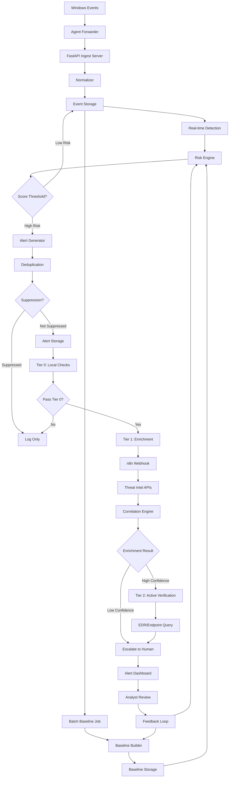
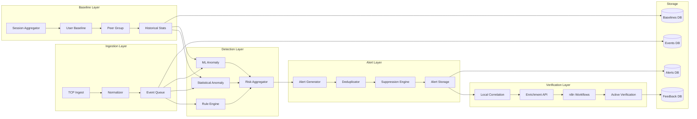

# Modern UEBA Alert System Architecture Proposal

**Version:** 1.0  
**Date:** 2024-01-XX  
**Author:** SOC Architecture Team  
**Status:** Proposal for Implementation

---

## Executive Summary

This proposal outlines a modern, production-ready UEBA alert system for Windows telemetry that balances detection accuracy with operational efficiency. The system implements a **tiered verification pipeline** that reduces false positives through automated enrichment and correlation before human escalation.

### Key Design Principles

1. **Defense in Depth**: Multiple detection layers (rule-based, statistical, ML)
2. **Progressive Verification**: Automated checks before human review
3. **Alert Quality First**: Deduplication, suppression, and feedback loops
4. **Scalable Architecture**: Supports both real-time and batch processing
5. **Open Source First**: Prefer offline-capable, open-source tools

### Core Capabilities

- **Real-time anomaly detection** (within seconds of event ingestion)
- **Batch baseline updates** (hourly/daily aggregations)
- **Multi-layer risk scoring** (rule + statistical + ML)
- **Automated enrichment** (n8n workflows, threat intel)
- **Alert correlation** (event timeline, session context)
- **False positive reduction** (allowlists, suppression, feedback)

---

## 1. Alerting Architecture (End-to-End)

### 1.1 High-Level Flow



### 1.2 Component Architecture



### 1.3 Real-Time vs Batch Processing

**Real-Time Stream (Sub-second to seconds):**
- Event ingestion → Normalization → Rule-based detection → Immediate alert (if threshold exceeded)
- Use case: Critical events (lock/unlock anomalies, suspicious PowerShell, mass file delete)

**Batch Jobs (Hourly/Daily):**
- Baseline computation → Statistical anomaly detection → ML model inference → Aggregated alerts
- Use case: Behavioral patterns (unusual logon hours, rare process usage, peer group deviations)

**Hybrid Approach (Recommended):**
- Real-time for high-severity rules (immediate response)
- Batch for complex patterns (lower false positives)

---

## 2. Normal Behavior Modeling (Windows UEBA)

### 2.1 Baseline Approaches

#### Option A: Statistical/Rule + Rarity Scoring (MVP - Fast & Reliable)

**Approach:** Sliding window statistics + rarity thresholds

**Features:**
- **Hourly Activity Histogram** (0-23): Track typical logon/lock/unlock hours per user
- **Process Frequency**: Top-N common processes, flag rare processes (< 3 occurrences in 30 days)
- **DNS Domain Rarity**: Track common domains, flag new/rare domains
- **File Path Rarity**: Common directories (Downloads, Documents), flag unusual paths
- **RDP Patterns**: Typical RDP hours, source IPs, session duration
- **PowerShell Usage**: Script block frequency, encoded command detection
- **Lock/Unlock Frequency**: Typical locks per day, unlock hours

**Implementation:**
```python
# Pseudo-code
class StatisticalBaseline:
    def compute_baseline(user, window_days=30):
        events = get_events(user, last_n_days=window_days)
        
        return {
            "hourly_histogram": compute_histogram(events, "hour"),
            "common_processes": top_n(events, "process_name", n=50),
            "common_domains": top_n(events, "dns_query", n=100),
            "common_paths": top_n(events, "file_path", n=200),
            "rdp_patterns": {
                "typical_hours": [9, 10, 11, 14, 15, 16],
                "common_source_ips": [...],
                "avg_session_duration": 4.5  # hours
            },
            "locks_per_day_avg": 12.3,
            "unlocks_per_day_avg": 12.3,
            "lock_hour_distribution": [0.05, 0.02, ..., 0.15, 0.12, ...]
        }
    
    def score_rarity(event, baseline):
        score = 0.0
        
        # Process rarity
        if event.process_name not in baseline.common_processes:
            score += 30.0
        
        # Hour rarity
        if event.hour not in baseline.typical_hours:
            score += 20.0
        
        # Domain rarity
        if event.dns_query not in baseline.common_domains:
            score += 25.0
        
        return min(score, 100.0)
```

**Pros:**
- ✅ Fast (< 5ms per event)
- ✅ Interpretable (analyst can see why)
- ✅ Low false positives (tuned thresholds)
- ✅ No training data required
- ✅ Works immediately

**Cons:**
- ❌ May miss complex patterns
- ❌ Requires manual threshold tuning
- ❌ Limited to known patterns

**Performance:** ~1000 events/second per core

---

#### Option B: ML Anomaly Detection (IsolationForest/OneClassSVM)

**Approach:** Unsupervised learning on feature vectors

**Features (same as Option A, but vectorized):**
```python
feature_vector = [
    hour_of_day,  # 0-23
    day_of_week,  # 0-6
    process_rarity_score,  # 0-1
    domain_rarity_score,  # 0-1
    path_rarity_score,  # 0-1
    lock_count_today,  # normalized
    unlock_count_today,  # normalized
    rdp_session_duration,  # normalized
    powershell_script_length,  # normalized
    file_operations_count,  # normalized
    network_connections_count,  # normalized
    # ... more features
]
```

**Implementation:**
```python
from sklearn.ensemble import IsolationForest
from sklearn.preprocessing import StandardScaler

class MLAnomalyDetector:
    def __init__(self):
        self.model = IsolationForest(
            contamination=0.1,  # Expect 10% anomalies
            random_state=42,
            n_estimators=100
        )
        self.scaler = StandardScaler()
        self.baseline_features = None
    
    def train(self, user_events):
        # Extract features from historical events
        X = [extract_features(e) for e in user_events]
        X_scaled = self.scaler.fit_transform(X)
        self.model.fit(X_scaled)
        self.baseline_features = X_scaled
    
    def predict(self, event):
        features = extract_features(event)
        X_scaled = self.scaler.transform([features])
        anomaly_score = self.model.score_samples(X_scaled)[0]
        is_anomaly = self.model.predict(X_scaled)[0] == -1
        
        return {
            "anomaly_score": anomaly_score,  # Lower = more anomalous
            "is_anomaly": is_anomaly,
            "confidence": 1.0 - (anomaly_score / self.model.score_samples(self.baseline_features).min())
        }
```

**Pros:**
- ✅ Detects complex, non-linear patterns
- ✅ Adapts to user behavior automatically
- ✅ Can find unknown attack patterns
- ✅ Good for peer group comparison

**Cons:**
- ❌ Requires training data (2-4 weeks minimum)
- ❌ Slower than statistical (10-50ms per event)
- ❌ Less interpretable (black box)
- ❌ May have higher false positives initially

**Performance:** ~100-200 events/second per core

---

#### Option C: Streaming Anomaly Detection (River Library)

**Approach:** Online learning, adapts in real-time

**Implementation:**
```python
from river import anomaly, preprocessing

class StreamingAnomalyDetector:
    def __init__(self):
        self.model = anomaly.HalfSpaceTrees(
            n_trees=25,
            height=15,
            window_size=250,
            seed=42
        )
        self.scaler = preprocessing.StandardScaler()
    
    def update(self, event):
        features = extract_features(event)
        features_scaled = self.scaler.learn_one(features).transform_one(features)
        score = self.model.score_one(features_scaled)
        self.model.learn_one(features_scaled)
        
        return {
            "anomaly_score": score,
            "is_anomaly": score > 0.7  # threshold
        }
```

**Pros:**
- ✅ Adapts continuously (no retraining)
- ✅ Memory efficient (sliding window)
- ✅ Good for concept drift
- ✅ Real-time learning

**Cons:**
- ❌ May be sensitive to initial data
- ❌ Requires careful tuning
- ❌ Less mature ecosystem

**Performance:** ~500 events/second per core

---

### 2.2 Recommended Approach: Hybrid (Statistical + ML)

**Phase 1 (MVP):** Statistical baseline + rarity scoring
- Fast, reliable, interpretable
- Deploy immediately

**Phase 2 (Enhancement):** Add ML anomaly detection
- Train on 2-4 weeks of data
- Use for complex pattern detection
- Combine scores: `final_score = 0.6 * statistical + 0.4 * ml`

**Phase 3 (Advanced):** Peer group baselines
- Compare user to similar users (same department, role)
- Flag if user deviates from peer group

---

## 3. Alert Definition & Data Model

### 3.1 Alert Schema

```sql
CREATE TABLE alerts (
    alert_id INTEGER PRIMARY KEY AUTOINCREMENT,
    
    -- Entity identification
    user TEXT NOT NULL,
    host TEXT NOT NULL,
    entity_type TEXT NOT NULL DEFAULT 'user',  -- 'user' | 'host' | 'session'
    
    -- Time window
    first_seen TEXT NOT NULL,  -- ISO 8601 UTC
    last_seen TEXT NOT NULL,   -- ISO 8601 UTC
    time_window_start TEXT NOT NULL,
    time_window_end TEXT NOT NULL,
    
    -- Severity and scoring
    severity TEXT NOT NULL,  -- 'critical' | 'high' | 'medium' | 'low' | 'info'
    risk_score REAL NOT NULL,  -- 0-100
    confidence REAL,  -- 0-1, from ML model or enrichment
    
    -- Alert details
    alert_type TEXT NOT NULL,  -- 'lock_unlock_anomaly' | 'unusual_logon' | 'rare_process' | ...
    title TEXT NOT NULL,
    description TEXT,
    reasons_json TEXT NOT NULL,  -- JSON array of reason strings
    
    -- Evidence
    evidence_event_ids TEXT NOT NULL,  -- JSON array of event IDs
    evidence_count INTEGER NOT NULL DEFAULT 1,
    
    -- Context
    tags TEXT,  -- JSON array of tags: ['powershell', 'encoded', 'suspicious']
    mitre_mapping TEXT,  -- JSON: {"technique": "T1059.001", "tactic": "Execution"}
    
    -- Status and workflow
    status TEXT NOT NULL DEFAULT 'open',  -- 'open' | 'investigating' | 'enriched' | 'verified' | 'false_positive' | 'true_positive' | 'resolved'
    assigned_to TEXT,
    priority INTEGER DEFAULT 50,  -- 0-100, higher = more urgent
    
    -- Deduplication
    dedup_key TEXT NOT NULL UNIQUE,  -- Composite key for deduplication
    dedup_window_hours INTEGER DEFAULT 24,
    
    -- Verification
    tier_0_passed BOOLEAN DEFAULT FALSE,
    tier_1_passed BOOLEAN DEFAULT FALSE,
    tier_2_passed BOOLEAN DEFAULT FALSE,
    enrichment_data TEXT,  -- JSON: results from n8n/enrichment
    
    -- Feedback
    analyst_feedback TEXT,  -- 'true_positive' | 'false_positive' | 'benign'
    feedback_notes TEXT,
    feedback_timestamp TEXT,
    
    -- Metadata
    created_at TEXT NOT NULL DEFAULT (datetime('now')),
    updated_at TEXT NOT NULL DEFAULT (datetime('now')),
    
    -- Indexes
    INDEX idx_alerts_user_host (user, host),
    INDEX idx_alerts_severity (severity),
    INDEX idx_alerts_status (status),
    INDEX idx_alerts_first_seen (first_seen DESC),
    INDEX idx_alerts_dedup_key (dedup_key)
);
```

### 3.2 Alert Generation Example

```python
def generate_alert(
    user: str,
    host: str,
    alert_type: str,
    events: List[NormalizedEvent],
    risk_score: float,
    reasons: List[str],
    mitre_mapping: Dict
) -> Alert:
    """Generate an alert from detected anomalies."""
    
    # Compute time window
    timestamps = [e.timestamp for e in events]
    time_window_start = min(timestamps)
    time_window_end = max(timestamps)
    first_seen = time_window_start
    last_seen = time_window_end
    
    # Determine severity
    if risk_score >= 80:
        severity = "critical"
    elif risk_score >= 60:
        severity = "high"
    elif risk_score >= 40:
        severity = "medium"
    elif risk_score >= 20:
        severity = "low"
    else:
        severity = "info"
    
    # Generate deduplication key
    dedup_key = generate_dedup_key(
        user=user,
        host=host,
        alert_type=alert_type,
        time_bucket=time_window_start[:13]  # Hour-level bucket
    )
    
    # Extract tags
    tags = extract_tags(events, alert_type)
    
    # Create alert
    alert = Alert(
        user=user,
        host=host,
        first_seen=first_seen,
        last_seen=last_seen,
        time_window_start=time_window_start,
        time_window_end=time_window_end,
        severity=severity,
        risk_score=risk_score,
        alert_type=alert_type,
        title=f"{alert_type.replace('_', ' ').title()} - {user}@{host}",
        description=generate_description(alert_type, events),
        reasons_json=json.dumps(reasons),
        evidence_event_ids=json.dumps([e.id for e in events]),
        evidence_count=len(events),
        tags=json.dumps(tags),
        mitre_mapping=json.dumps(mitre_mapping),
        dedup_key=dedup_key,
        status="open"
    )
    
    return alert

def generate_dedup_key(user: str, host: str, alert_type: str, time_bucket: str) -> str:
    """Generate deduplication key."""
    return f"{user}:{host}:{alert_type}:{time_bucket}"

def extract_tags(events: List[NormalizedEvent], alert_type: str) -> List[str]:
    """Extract relevant tags from events."""
    tags = [alert_type]
    
    for event in events:
        if event.action_type == "ps_scriptblock":
            tags.append("powershell")
        if event.action_type == "lock" or event.action_type == "unlock":
            tags.append("lock_unlock")
        if "encoded" in event.command_line.lower():
            tags.append("encoded")
        if event.risk_level == "high":
            tags.append("high_risk")
    
    return list(set(tags))  # Deduplicate
```

### 3.3 Event-to-Alert Aggregation

**Session-Level Aggregation:**
```python
def aggregate_session_risk(session_id: str, events: List[NormalizedEvent]) -> float:
    """Aggregate event-level risk scores to session risk."""
    if not events:
        return 0.0
    
    # Weight recent events more
    weights = [1.0 - (i * 0.1) for i in range(len(events))]
    weights = [w / sum(weights) for w in weights]  # Normalize
    
    session_score = sum(
        event.risk_score * weight
        for event, weight in zip(events, weights)
    )
    
    return min(session_score, 100.0)
```

**Daily Aggregation:**
```python
def aggregate_daily_risk(user: str, date: str) -> Dict:
    """Aggregate all alerts/events for a user on a given day."""
    events = get_events(user, date_start=date, date_end=date)
    alerts = get_alerts(user, date_start=date, date_end=date)
    
    return {
        "total_events": len(events),
        "total_alerts": len(alerts),
        "max_risk_score": max([a.risk_score for a in alerts], default=0.0),
        "critical_alerts": len([a for a in alerts if a.severity == "critical"]),
        "risk_timeline": build_risk_timeline(events, alerts)
    }
```

---

## 4. Verification / Enrichment Stage

### 4.1 Tiered Verification Strategy

#### Tier 0: Local Checks (Fast, No External Calls)

**Checks:**
1. **Allowlist Validation**: Check if user/host/process/domain is in allowlist
2. **Suppression Rules**: Check if alert matches suppression criteria
3. **DB Correlation**: Check for similar recent alerts (within 1 hour)
4. **Baseline Deviation**: Verify deviation is significant (> 2 standard deviations)

**Implementation:**
```python
def tier_0_verification(alert: Alert) -> Tuple[bool, str]:
    """Tier 0: Local checks only."""
    
    # Check allowlist
    if is_allowlisted(alert.user, alert.host, alert.alert_type):
        return False, "Allowlisted"
    
    # Check suppression
    if is_suppressed(alert.dedup_key):
        return False, "Suppressed"
    
    # Check correlation (similar alerts in last hour)
    similar_alerts = get_similar_alerts(alert, window_hours=1)
    if len(similar_alerts) > 5:  # Too many similar alerts
        return False, "Too many similar alerts (likely noise)"
    
    # Check baseline deviation significance
    if alert.risk_score < 30:  # Low risk
        return False, "Risk score too low"
    
    return True, "Passed Tier 0"
```

#### Tier 1: Enrichment (External APIs, No Active Queries)

**Enrichment Sources:**
1. **GeoIP**: IP geolocation (MaxMind, ipapi.co)
2. **Domain Reputation**: VirusTotal, AbuseIPDB, URLhaus
3. **Hash Reputation**: VirusTotal, Hybrid Analysis
4. **WHOIS**: Domain registration info
5. **Passive DNS**: Historical DNS records

**n8n Workflow Examples:**

**Workflow 1: High-Severity Alert Enrichment**
```yaml
Trigger: HTTP Webhook (POST /n8n/webhook/alert)
Steps:
  1. Parse alert JSON
  2. Extract IOCs (IPs, domains, hashes)
  3. Enrich IPs:
     - GeoIP lookup
     - AbuseIPDB reputation
  4. Enrich Domains:
     - VirusTotal domain report
     - WHOIS lookup
  5. Enrich Hashes (if present):
     - VirusTotal file report
  6. Correlate with recent events:
     - Query DB for same user's events in last 10 minutes
  7. Update alert in DB:
     - Add enrichment_data JSON
     - Set tier_1_passed = true
  8. If confidence > 0.8:
     - Send to Tier 2 (active verification)
  9. Else:
     - Notify analyst (Telegram/Slack/Email)
```

**Workflow 2: Lock/Unlock + PowerShell Correlation**
```yaml
Trigger: Alert with tags: ['lock_unlock', 'powershell']
Steps:
  1. Get lock/unlock events (4800/4801)
  2. Get PowerShell events within 10 minutes
  3. Check if PowerShell script is encoded/suspicious
  4. Check if unlock happened at unusual hour
  5. Correlate: Did user unlock → immediately run PowerShell?
  6. If correlation found:
     - Increase risk_score by 20
     - Add tag: 'suspicious_sequence'
     - Escalate to Tier 2
```

**Workflow 3: Hash Reputation Check (Safe)**
```yaml
Trigger: Alert with file_hash present
Steps:
  1. Check if hash is in allowlist (known good)
  2. If not, query VirusTotal (rate-limited)
  3. If malicious (> 5 detections):
     - Set severity = 'critical'
     - Add tag: 'malicious_hash'
     - Escalate immediately
  4. If clean:
     - Add to allowlist (optional)
     - Reduce risk_score
```

**Workflow 4: Auto-Case Creation**
```yaml
Trigger: Alert severity >= 'high' AND tier_1_passed = true
Steps:
  1. Create case in TheHive (or Jira/GitHub)
  2. Link alert to case
  3. Add enrichment data to case
  4. Assign to SOC team
  5. Send notification
```

**Workflow 5: Domain Reputation + Passive DNS**
```yaml
Trigger: Alert with DNS/domain IOCs
Steps:
  1. Extract domains from events
  2. Query VirusTotal for domain reputation
  3. Query Passive DNS (if available)
  4. Check if domain is newly registered (< 30 days)
  5. Check if domain has suspicious TLD (.tk, .xyz, etc.)
  6. Aggregate reputation score
  7. Update alert confidence
```

#### Tier 2: Active Verification (Optional, Requires Endpoint Access)

**Checks:**
1. **EDR API Query**: Check endpoint state (running processes, network connections)
2. **osquery**: Query endpoint for detailed system state
3. **Agent Status**: Check if agent is healthy, last heartbeat
4. **File System Check**: Verify file existence, hash, permissions

**Implementation:**
```python
def tier_2_verification(alert: Alert) -> Tuple[bool, Dict]:
    """Tier 2: Active endpoint verification."""
    
    results = {}
    
    # Query EDR API (if available)
    if has_edr_api():
        edr_data = query_edr_api(alert.host)
        results["edr_processes"] = edr_data.get("running_processes", [])
        results["edr_network"] = edr_data.get("network_connections", [])
    
    # Query osquery (if agent supports it)
    if has_osquery(alert.host):
        osquery_results = query_osquery(alert.host, [
            "SELECT * FROM processes WHERE name = ?",
            "SELECT * FROM listening_ports"
        ])
        results["osquery"] = osquery_results
    
    # Check agent health
    agent_status = get_agent_status(alert.host)
    results["agent_healthy"] = agent_status.get("healthy", False)
    results["last_heartbeat"] = agent_status.get("last_heartbeat")
    
    # Determine if verification passed
    passed = (
        results.get("agent_healthy", False) and
        not has_suspicious_processes(results.get("edr_processes", []))
    )
    
    return passed, results
```

#### Tier 3: Human Escalation

**Escalation Criteria:**
- Alert severity = "critical" AND confidence > 0.7
- Alert severity = "high" AND tier_2_passed = false
- Multiple related alerts for same user/host
- Analyst manually escalates

**Notification Channels:**
- Slack/Teams channel
- Email (PagerDuty-style)
- Telegram bot
- Dashboard alert banner

---

### 4.2 Alternatives to n8n

| Tool | Pros | Cons | Best For |
|------|------|------|----------|
| **n8n** | ✅ Easy setup, visual workflows, self-hosted | ❌ Less mature than Zapier | MVP, small teams |
| **Shuffle SOAR** | ✅ Open source, security-focused, playbooks | ❌ Steeper learning curve | Security teams |
| **TheHive + Cortex** | ✅ Case management + analyzers, mature | ❌ More complex setup | SOC operations |
| **StackStorm** | ✅ Powerful, event-driven, integrations | ❌ Complex, requires DevOps | Large orgs |
| **Airflow** | ✅ Great for batch jobs, scheduling | ❌ Not real-time, complex | Data pipelines |
| **Celery + Redis** | ✅ Fast, scalable, Python-native | ❌ Requires code, no UI | Developers |
| **Kafka Streams** | ✅ High throughput, real-time | ❌ Complex, overkill for MVP | Enterprise scale |

**Recommendation for MVP:** **n8n** (easiest) or **Shuffle SOAR** (more security-focused)

---

## 5. Alert Quality Controls

### 5.1 Deduplication

**Strategy:** Composite key based on entity + alert type + time bucket

```python
def generate_dedup_key(user: str, host: str, alert_type: str, time_bucket: str) -> str:
    """Generate deduplication key."""
    # Time bucket: hour-level (2024-01-15T14:00:00Z -> 2024-01-15T14)
    return f"{user}:{host}:{alert_type}:{time_bucket}"

def check_duplicate(alert: Alert) -> Optional[Alert]:
    """Check if similar alert exists."""
    existing = get_alert_by_dedup_key(alert.dedup_key)
    
    if existing:
        # Update existing alert
        existing.last_seen = alert.last_seen
        existing.evidence_count += alert.evidence_count
        existing.evidence_event_ids = merge_event_ids(
            existing.evidence_event_ids,
            alert.evidence_event_ids
        )
        # Increase risk score if new evidence
        if alert.risk_score > existing.risk_score:
            existing.risk_score = alert.risk_score
        return existing
    
    return None
```

### 5.2 Alert Grouping

**Group related alerts:**
```python
def group_alerts(alerts: List[Alert], window_minutes: int = 30) -> List[AlertGroup]:
    """Group alerts by user/host within time window."""
    groups = []
    
    for alert in alerts:
        # Find existing group
        group = find_group(groups, alert, window_minutes)
        
        if group:
            group.add_alert(alert)
        else:
            groups.append(AlertGroup([alert]))
    
    return groups

class AlertGroup:
    def __init__(self, alerts: List[Alert]):
        self.alerts = alerts
        self.user = alerts[0].user
        self.host = alerts[0].host
        self.severity = max([a.severity for a in alerts], key=severity_level)
        self.total_risk_score = sum([a.risk_score for a in alerts])
    
    def to_summary_alert(self) -> Alert:
        """Create a summary alert for the group."""
        return Alert(
            title=f"Multiple alerts: {len(self.alerts)} alerts for {self.user}@{self.host}",
            severity=self.severity,
            risk_score=min(self.total_risk_score, 100.0),
            # ... other fields
        )
```

### 5.3 Rate Limiting

**Prevent alert spam:**
```python
class AlertRateLimiter:
    def __init__(self):
        self.alert_counts = {}  # key -> [timestamps]
        self.max_alerts_per_hour = 10
        self.max_alerts_per_day = 50
    
    def should_allow(self, alert: Alert) -> bool:
        key = f"{alert.user}:{alert.host}:{alert.alert_type}"
        now = datetime.utcnow()
        
        # Clean old timestamps
        self.alert_counts[key] = [
            ts for ts in self.alert_counts.get(key, [])
            if (now - ts).total_seconds() < 86400  # 24 hours
        ]
        
        # Check hourly limit
        recent_hour = [
            ts for ts in self.alert_counts[key]
            if (now - ts).total_seconds() < 3600
        ]
        if len(recent_hour) >= self.max_alerts_per_hour:
            return False
        
        # Check daily limit
        if len(self.alert_counts[key]) >= self.max_alerts_per_day:
            return False
        
        # Allow
        self.alert_counts[key].append(now)
        return True
```

### 5.4 Suppression Windows

**Temporary suppression after false positive:**
```python
class SuppressionEngine:
    def __init__(self):
        self.suppressions = {}  # dedup_key -> expiry_time
    
    def suppress(self, dedup_key: str, hours: int = 24):
        """Suppress alert for N hours."""
        self.suppressions[dedup_key] = datetime.utcnow() + timedelta(hours=hours)
    
    def is_suppressed(self, dedup_key: str) -> bool:
        """Check if alert is suppressed."""
        if dedup_key not in self.suppressions:
            return False
        
        if datetime.utcnow() > self.suppressions[dedup_key]:
            # Expired
            del self.suppressions[dedup_key]
            return False
        
        return True
```

### 5.5 Allowlist / Exceptions Model

**Schema:**
```sql
CREATE TABLE allowlist_rules (
    id INTEGER PRIMARY KEY AUTOINCREMENT,
    rule_type TEXT NOT NULL,  -- 'user' | 'host' | 'process' | 'domain' | 'ip' | 'file_path'
    entity_value TEXT NOT NULL,  -- The actual value (username, process name, etc.)
    alert_type TEXT,  -- Specific alert type to allowlist (NULL = all)
    reason TEXT,
    created_by TEXT,
    created_at TEXT NOT NULL DEFAULT (datetime('now')),
    expires_at TEXT,  -- NULL = permanent
    is_active BOOLEAN DEFAULT TRUE,
    
    UNIQUE(rule_type, entity_value, alert_type)
);
```

**Usage:**
```python
def is_allowlisted(user: str, host: str, alert_type: str) -> bool:
    """Check if alert should be allowlisted."""
    rules = get_allowlist_rules()
    
    for rule in rules:
        if not rule.is_active:
            continue
        
        if rule.expires_at and datetime.fromisoformat(rule.expires_at) < datetime.utcnow():
            continue
        
        # Check user
        if rule.rule_type == 'user' and rule.entity_value == user:
            if rule.alert_type is None or rule.alert_type == alert_type:
                return True
        
        # Check host
        if rule.rule_type == 'host' and rule.entity_value == host:
            if rule.alert_type is None or rule.alert_type == alert_type:
                return True
    
    return False
```

### 5.6 Risk Score Decay

**Reduce alert urgency over time:**
```python
def apply_decay(alert: Alert) -> float:
    """Apply time-based decay to risk score."""
    age_hours = (datetime.utcnow() - datetime.fromisoformat(alert.first_seen)).total_seconds() / 3600
    
    # Decay formula: score * e^(-decay_rate * hours)
    decay_rate = 0.1  # 10% per hour
    decayed_score = alert.risk_score * math.exp(-decay_rate * age_hours)
    
    return max(decayed_score, 0.0)
```

### 5.7 Feedback Loop

**Schema:**
```sql
CREATE TABLE alert_feedback (
    id INTEGER PRIMARY KEY AUTOINCREMENT,
    alert_id INTEGER NOT NULL,
    analyst_user TEXT NOT NULL,
    feedback_type TEXT NOT NULL,  -- 'true_positive' | 'false_positive' | 'benign'
    notes TEXT,
    created_at TEXT NOT NULL DEFAULT (datetime('now')),
    
    FOREIGN KEY (alert_id) REFERENCES alerts(alert_id)
);
```

**Usage:**
```python
def process_feedback(alert_id: int, feedback: str, notes: str):
    """Process analyst feedback and update baselines/rules."""
    # Store feedback
    store_feedback(alert_id, feedback, notes)
    
    if feedback == "false_positive":
        # Suppress similar alerts
        alert = get_alert(alert_id)
        suppression_engine.suppress(alert.dedup_key, hours=24)
        
        # Update allowlist if appropriate
        if "known good process" in notes.lower():
            add_allowlist_rule("process", extract_process(notes))
    
    elif feedback == "true_positive":
        # Strengthen rule thresholds
        alert = get_alert(alert_id)
        if alert.risk_score < 60:
            # Increase threshold for this alert type
            update_rule_threshold(alert.alert_type, multiplier=1.2)
```

---

## 6. Implementation Plan

### Phase 1: MVP (1-3 Days)

**Goal:** Basic alerting with rule-based detection + n8n webhook

**Tasks:**
1. ✅ Create `alerts` table (already exists, enhance if needed)
2. ✅ Implement `AlertGenerator` class
3. ✅ Implement `Deduplicator` class
4. ✅ Add 5-10 high-signal alert rules
5. ✅ Create n8n webhook endpoint
6. ✅ Implement Tier 0 verification
7. ✅ Create alert dashboard page

**Required Tables:**
- `alerts` (enhance existing)
- `allowlist_rules` (new)
- `alert_feedback` (new)

**Background Jobs:**
- None (real-time only for MVP)

**API Endpoints:**
```python
# FastAPI endpoints
POST /api/alerts/generate  # Internal (called by risk engine)
GET /api/alerts  # List alerts
GET /api/alerts/{alert_id}  # Get alert details
POST /api/alerts/{alert_id}/feedback  # Analyst feedback
POST /api/alerts/{alert_id}/suppress  # Suppress alert
POST /n8n/webhook/alert  # n8n webhook receiver
```

**Test Scenarios:**
1. Lock/unlock at unusual hour → alert generated
2. Rare process execution → alert generated
3. Duplicate alert → deduplicated
4. Allowlisted user → no alert
5. n8n webhook → receives alert JSON

---

### Phase 2: Enhanced Detection (1-2 Weeks)

**Goal:** ML anomaly detection + peer groups + better UI

**Tasks:**
1. ✅ Implement `IsolationForestAnomalyDetector`
2. ✅ Train models on 2-4 weeks of data
3. ✅ Implement peer group baselines
4. ✅ Add batch baseline jobs (hourly)
5. ✅ Enhance alert dashboard (timeline, correlation)
6. ✅ Implement Tier 1 enrichment (n8n workflows)
7. ✅ Add alert grouping

**Required Tables:**
- `baseline_stats` (already exists)
- `peer_groups` (new)
- `ml_model_versions` (new)

**Background Jobs:**
```python
# Scheduled jobs (APScheduler)
@schedule.every(hour=1)
def update_baselines():
    """Hourly baseline update."""
    baseline_builder.update_all_baselines()

@schedule.every(day=1, hour=2)
def train_ml_models():
    """Daily ML model retraining."""
    anomaly_detector.train_all_models()
```

**API Endpoints:**
```python
GET /api/alerts/grouped  # Grouped alerts
GET /api/alerts/{alert_id}/timeline  # Event timeline
GET /api/baselines/{user}  # User baseline
POST /api/baselines/{user}/peer-group  # Peer group comparison
```

**Test Scenarios:**
1. ML model detects anomaly → alert generated
2. Peer group deviation → alert generated
3. Alert grouping → related alerts grouped
4. Enrichment workflow → alert enriched with threat intel

---

### Phase 3: Advanced Features (Optional, 2-4 Weeks)

**Goal:** Case management + automated response

**Tasks:**
1. ✅ Integrate TheHive (case management)
2. ✅ Implement Tier 2 active verification
3. ✅ Add automated response actions (isolate endpoint, block IP)
4. ✅ Advanced correlation engine
5. ✅ Reporting and analytics

**Required Tables:**
- `cases` (new)
- `response_actions` (new)

**Background Jobs:**
- Case auto-creation
- Automated response execution

**API Endpoints:**
```python
POST /api/cases  # Create case
POST /api/response/isolate  # Isolate endpoint
POST /api/response/block-ip  # Block IP
```

---

## 7. Example Alert Rules (Windows-Focused)

### Rule 1: Lock/Unlock Anomaly

**Description:** Unusual lock/unlock pattern (unlock at unusual hour, too many locks, lock after suspicious process)

**Event Sources:** Security (4800, 4801)

**Features Needed:**
- `lock_hour_distribution` (baseline)
- `locks_per_day_avg` (baseline)
- `unlocks_per_day_avg` (baseline)
- Recent process events before lock

**Risk Scoring:**
```python
def score_lock_unlock_anomaly(event: NormalizedEvent, baseline: Baseline) -> float:
    score = 0.0
    
    if event.action_type == "unlock":
        hour = event.timestamp.hour
        if hour not in baseline.typical_unlock_hours:
            score += 30.0  # Unusual hour
        
        # Check if unlock happened after suspicious process
        recent_processes = get_recent_processes(event.user, event.host, minutes=5)
        if has_suspicious_process(recent_processes):
            score += 40.0
    
    if event.action_type == "lock":
        # Check if too many locks today
        locks_today = count_locks_today(event.user, event.host)
        if locks_today > baseline.locks_per_day_avg * 3:
            score += 25.0
    
    return min(score, 100.0)
```

**MITRE Mapping:** `T1078` (Valid Accounts), `T1110` (Brute Force)

---

### Rule 2: Unusual Logon Hour

**Description:** User logs on at hour outside their typical pattern

**Event Sources:** Security (4624)

**Features Needed:**
- `logon_hour_histogram` (baseline)

**Risk Scoring:**
```python
def score_unusual_logon_hour(event: NormalizedEvent, baseline: Baseline) -> float:
    hour = event.timestamp.hour
    
    if hour not in baseline.typical_logon_hours:
        # Calculate rarity
        hour_frequency = baseline.logon_hour_histogram.get(hour, 0)
        avg_frequency = sum(baseline.logon_hour_histogram.values()) / 24
        
        if hour_frequency < avg_frequency * 0.1:  # Very rare
            return 50.0
        elif hour_frequency < avg_frequency * 0.3:  # Rare
            return 30.0
    
    return 0.0
```

**MITRE Mapping:** `T1078` (Valid Accounts)

---

### Rule 3: Rare PowerShell / Encoded Command

**Description:** PowerShell script execution with encoded/obfuscated commands or rare script blocks

**Event Sources:** PowerShell Operational (4103, 4104, 4105, 4106)

**Features Needed:**
- `powershell_script_frequency` (baseline)
- Command line analysis (encoded detection)

**Risk Scoring:**
```python
def score_powershell_anomaly(event: NormalizedEvent, baseline: Baseline) -> float:
    score = 0.0
    
    # Check if script is rare
    script_hash = hash_script(event.command_line)
    if script_hash not in baseline.common_powershell_scripts:
        score += 30.0
    
    # Check for encoding/obfuscation
    if is_encoded(event.command_line):
        score += 40.0
    if is_obfuscated(event.command_line):
        score += 35.0
    
    # Check for suspicious patterns
    suspicious_patterns = [
        "downloadstring", "invoke-expression", "iex",
        "bypass", "hidden", "encodedcommand"
    ]
    for pattern in suspicious_patterns:
        if pattern.lower() in event.command_line.lower():
            score += 20.0
    
    return min(score, 100.0)
```

**MITRE Mapping:** `T1059.001` (Command and Scripting Interpreter: PowerShell)

---

### Rule 4: Mass File Delete / Ransomware-Like

**Description:** Large number of file deletions in short time window

**Event Sources:** Sysmon (23, 26), Security (4663)

**Features Needed:**
- `file_delete_count` (session aggregation)
- File extension analysis

**Risk Scoring:**
```python
def score_mass_file_delete(user: str, host: str, window_minutes: int = 5) -> float:
    events = get_file_delete_events(user, host, window_minutes)
    
    if len(events) < 10:
        return 0.0
    
    score = min(len(events) * 2, 60.0)  # 10 files = 20, 30 files = 60
    
    # Check for ransomware patterns
    extensions = [get_file_extension(e.target_filename) for e in events]
    if len(set(extensions)) > 10:  # Many different file types
        score += 20.0
    
    # Check if files are in user directories
    user_dirs = ["Documents", "Pictures", "Desktop", "Downloads"]
    if any(any(d in e.target_filename for d in user_dirs) for e in events):
        score += 15.0
    
    return min(score, 100.0)
```

**MITRE Mapping:** `T1486` (Data Encrypted for Impact), `T1490` (Inhibit System Recovery)

---

### Rule 5: Unusual RDP Behavior

**Description:** RDP connection from unusual source IP, at unusual hour, or abnormal session duration

**Event Sources:** TerminalServices channels, Security (4624 with logon_type=10)

**Features Needed:**
- `rdp_source_ips` (baseline)
- `rdp_session_duration_avg` (baseline)
- `rdp_typical_hours` (baseline)

**Risk Scoring:**
```python
def score_rdp_anomaly(event: NormalizedEvent, baseline: Baseline) -> float:
    score = 0.0
    
    if event.logon_type == 10:  # RDP
        # Check source IP
        if event.source_ip not in baseline.common_rdp_source_ips:
            score += 30.0
        
        # Check hour
        hour = event.timestamp.hour
        if hour not in baseline.typical_rdp_hours:
            score += 25.0
        
        # Check session duration (if available)
        if event.session_duration:
            if event.session_duration > baseline.rdp_session_duration_avg * 3:
                score += 20.0
    
    return min(score, 100.0)
```

**MITRE Mapping:** `T1021.001` (Remote Services: Remote Desktop Protocol)

---

### Rule 6: Defender Alert Correlation

**Description:** Windows Defender alert correlated with suspicious process/network activity

**Event Sources:** Defender Operational, Sysmon, Security

**Features Needed:**
- Defender event correlation
- Process/network context

**Risk Scoring:**
```python
def score_defender_correlation(defender_event: NormalizedEvent) -> float:
    score = 50.0  # Base score for Defender alert
    
    # Get related events (same user/host, within 5 minutes)
    related_events = get_related_events(
        defender_event.user,
        defender_event.host,
        window_minutes=5
    )
    
    # Check for suspicious processes
    suspicious_processes = ["powershell", "cmd", "wscript", "cscript"]
    for event in related_events:
        if event.process_name and any(
            sp in event.process_name.lower() for sp in suspicious_processes
        ):
            score += 20.0
        
        # Check for network connections
        if event.action_type == "network_connect":
            if is_external_ip(event.dest_ip):
                score += 15.0
    
    return min(score, 100.0)
```

**MITRE Mapping:** `T1562.001` (Impair Defenses: Disable or Modify Tools)

---

### Rule 7: WMI Persistence Behavior

**Description:** WMI event filter/consumer creation (common persistence technique)

**Event Sources:** WMI Activity Operational (5857, 5858, 5859, 5860, 5861)

**Features Needed:**
- WMI event frequency (baseline)
- Process context

**Risk Scoring:**
```python
def score_wmi_persistence(event: NormalizedEvent, baseline: Baseline) -> float:
    score = 0.0
    
    # WMI filter/consumer creation is rare
    if event.action_type in ["wmi_filter", "wmi_consumer"]:
        score += 60.0  # High base score
    
    # Check if created by suspicious process
    if event.process_name:
        suspicious_parents = ["powershell", "cmd", "wmic"]
        if any(sp in event.process_name.lower() for sp in suspicious_parents):
            score += 25.0
    
    # Check if WMI events are rare for this user
    wmi_count_30d = count_wmi_events(event.user, event.host, days=30)
    if wmi_count_30d < 5:  # Very rare
        score += 15.0
    
    return min(score, 100.0)
```

**MITRE Mapping:** `T1546.003` (Event Triggered Execution: WMI Event Subscription)

---

### Rule 8: Rare Process Execution

**Description:** Process execution not seen in user's baseline (new/rare process)

**Event Sources:** Sysmon (1), Security (4688)

**Features Needed:**
- `common_processes` (baseline)
- Process frequency counts

**Risk Scoring:**
```python
def score_rare_process(event: NormalizedEvent, baseline: Baseline) -> float:
    process_name = event.process_name.lower()
    
    if process_name in baseline.common_processes:
        return 0.0
    
    # Check frequency in last 30 days
    frequency = get_process_frequency(event.user, event.host, process_name, days=30)
    
    if frequency == 0:
        # Never seen before
        score = 40.0
    elif frequency < 3:
        # Rare (seen < 3 times)
        score = 25.0
    else:
        return 0.0
    
    # Bonus if process is in suspicious locations
    if event.image_path:
        suspicious_paths = ["temp", "appdata\\local\\temp", "downloads"]
        if any(sp in event.image_path.lower() for sp in suspicious_paths):
            score += 20.0
    
    return min(score, 100.0)
```

**MITRE Mapping:** `T1105` (Ingress Tool Transfer), `T1059` (Command and Scripting Interpreter)

---

### Rule 9: Unusual DNS Domain

**Description:** DNS query to domain not in user's baseline (rare/new domain)

**Event Sources:** Sysmon (22)

**Features Needed:**
- `common_domains` (baseline)
- Domain reputation (optional)

**Risk Scoring:**
```python
def score_rare_domain(event: NormalizedEvent, baseline: Baseline) -> float:
    domain = event.dns_query.lower()
    
    if domain in baseline.common_domains:
        return 0.0
    
    # Check frequency
    frequency = get_domain_frequency(event.user, event.host, domain, days=30)
    
    if frequency == 0:
        score = 30.0
    elif frequency < 5:
        score = 15.0
    else:
        return 0.0
    
    # Check for suspicious TLDs
    suspicious_tlds = [".tk", ".xyz", ".top", ".click", ".download"]
    if any(domain.endswith(tld) for tld in suspicious_tlds):
        score += 20.0
    
    # Check for DGA-like patterns
    if is_dga_like(domain):
        score += 25.0
    
    return min(score, 100.0)
```

**MITRE Mapping:** `T1071.004` (Application Layer Protocol: DNS), `T1568` (Dynamic Resolution)

---

### Rule 10: Scheduled Task Creation (Persistence)

**Description:** Scheduled task created by non-admin user or unusual process

**Event Sources:** TaskScheduler Operational, Security (4698)

**Features Needed:**
- Task creation frequency (baseline)
- Process context

**Risk Scoring:**
```python
def score_scheduled_task_anomaly(event: NormalizedEvent, baseline: Baseline) -> float:
    score = 0.0
    
    if event.action_type == "task_created":
        # Check if user is admin
        if not is_admin_user(event.user):
            score += 30.0
        
        # Check if created by suspicious process
        if event.process_name:
            suspicious = ["powershell", "cmd", "wscript"]
            if any(s in event.process_name.lower() for s in suspicious):
                score += 25.0
        
        # Check frequency
        task_count_30d = count_tasks_created(event.user, event.host, days=30)
        if task_count_30d < 3:  # Rare
            score += 20.0
    
    return min(score, 100.0)
```

**MITRE Mapping:** `T1053.005` (Scheduled Task/Job: Scheduled Task)

---

## 8. Recommended Tools & Libraries

### Detection & ML
- **scikit-learn**: IsolationForest, OneClassSVM, StandardScaler
- **River**: Streaming anomaly detection (optional)
- **NumPy/Pandas**: Feature extraction, data processing

### Workflow Automation
- **n8n**: Self-hosted workflow automation (recommended for MVP)
- **Shuffle SOAR**: Security-focused SOAR (alternative)
- **TheHive + Cortex**: Case management + analyzers (advanced)

### Threat Intelligence
- **VirusTotal API**: Hash/domain/IP reputation
- **AbuseIPDB API**: IP reputation
- **MaxMind GeoIP2**: IP geolocation
- **URLhaus**: Malware URL database

### Message Queues (Optional)
- **Redis**: Fast, simple (recommended for MVP)
- **RabbitMQ**: More features, AMQP protocol
- **Kafka**: High throughput (overkill for MVP)

### Database
- **SQLite**: Current (sufficient for MVP, < 1M events)
- **PostgreSQL**: Migration path for scale (> 1M events)

### Monitoring & Observability
- **Prometheus + Grafana**: Metrics and dashboards
- **ELK Stack**: Log aggregation (optional)

---

## 9. Constraints & Assumptions

### Constraints
1. **SQLite Limitations**: 
   - Concurrent writes may be slow (> 10 agents)
   - Consider PostgreSQL for production scale
2. **n8n Rate Limits**: 
   - External API calls (VirusTotal, etc.) have rate limits
   - Implement caching and rate limiting
3. **ML Model Training**: 
   - Requires 2-4 weeks of historical data
   - May have high false positives initially
4. **Real-time vs Batch**: 
   - Real-time detection is faster but may have more false positives
   - Batch detection is more accurate but delayed

### Assumptions
1. **Agent Coverage**: All endpoints have agent installed
2. **Network Access**: Server can reach n8n and external APIs
3. **Analyst Availability**: Analysts can provide feedback for tuning
4. **Data Retention**: 30-90 days of event history available
5. **Open Source Preference**: Prefer self-hosted, offline-capable tools

---

## 10. Test Plan

### Unit Tests
- Alert generation logic
- Deduplication logic
- Suppression engine
- Allowlist checks
- Risk score calculation

### Integration Tests
- End-to-end: Event → Alert → n8n → Enrichment
- Baseline computation → Anomaly detection → Alert
- Feedback loop → Suppression → Re-test

### Performance Tests
- Alert generation throughput (target: 100 alerts/second)
- Baseline computation time (target: < 5 minutes for 1000 users)
- ML model inference time (target: < 50ms per event)

### Acceptance Tests
1. Lock/unlock anomaly → Alert generated → n8n receives → Enriched
2. Rare process → Alert generated → Allowlisted → No alert
3. Duplicate alert → Deduplicated → Count incremented
4. False positive feedback → Suppressed → No future alerts

---

## Conclusion

This proposal provides a complete, production-ready UEBA alert system architecture that balances detection accuracy with operational efficiency. The phased implementation approach allows for rapid MVP deployment (1-3 days) while providing a clear path to advanced features.

**Key Success Factors:**
1. Start with statistical baselines (fast, reliable)
2. Implement strong alert quality controls (dedup, suppression, allowlists)
3. Use n8n for easy workflow automation
4. Build feedback loops for continuous improvement
5. Scale gradually (SQLite → PostgreSQL, real-time → batch)

**Next Steps:**
1. Review and approve architecture
2. Begin Phase 1 implementation
3. Set up n8n instance
4. Configure initial alert rules
5. Test with sample data
6. Deploy to production

---

*Document Version: 1.0*  
*Last Updated: 2024-01-XX*

